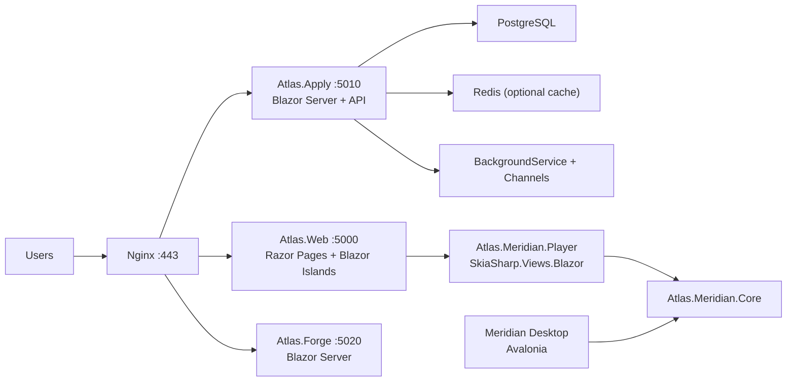

# Atlas Hybrid Rebuild Plan (Except ElectraCast)

> **Status:** Build-Ready (hardened 2026-02-19)
> **Target:** .NET 10 / ASP.NET Core / Blazor Server / Razor Pages / SkiaSharp
> **Scope:** All Atlas web surfaces EXCEPT ElectraCast
> **Reference Docs:**
>
> - [Parity Matrix](../../docs/architecture/Parity_Matrix.md)
> - [Hybrid Architecture Spec](../../docs/architecture/Hybrid_Architecture_Spec.md)
> - [Delivery & Cutover Plan](../../docs/architecture/Delivery_Cutover_Plan.md)

---

## Scope And Decisions

- Rebuild all Atlas web surfaces except ElectraCast: landing pages, project pages, login/auth flows, `/dev` portal, Atlas Apply, and Atlas Forge.
- Use hybrid strategy: keep Meridian canvas-native core in C# (Avalonia) and add web-facing delivery via Blazor Server + SkiaSharp.Views.Blazor.
- Preserve behavior parity first, then improve UX and architecture.
- Blazor **Server** (not WASM) chosen for all interactive surfaces due to single-droplet constraint.

## Migration Surface Summary


| Surface                          | Routes                   | Components                     | Complexity          | Target              |
| -------------------------------- | ------------------------ | ------------------------------ | ------------------- | ------------------- |
| frontend-main (portfolio + /dev) | 10                       | 18 Vue files                   | Low-Med             | Razor Pages SSR     |
| frontend (Atlas Apply)           | 12                       | 16 Vue files, 3 Pinia stores   | Med-High            | Blazor Server       |
| atlasforge (Forge)               | 1 SPA                    | 32 files (Vue + React + Astro) | High                | Blazor Server       |
| atlasops API                     | 60+ endpoints, 9 modules | FastAPI + Celery               | Med-High            | ASP.NET Minimal API |
| Meridian                         | Desktop (5 C# files)     | Avalonia + SkiaSharp           | N/A (desktop stays) | + Blazor Player     |


**Totals:** 23 routes, 71 components, 60+ API endpoints, 3 Pinia stores, 17 middleware concerns.

## Target Architecture




## Solution Structure (11 Projects)

```
AtlasUniversalis.sln
+-- src/
|   +-- Atlas.Web/              Razor Pages + Blazor Islands (portfolio, /dev)
|   +-- Atlas.Apply/            Blazor Server (Apply app + API host)
|   +-- Atlas.Forge/            Blazor Server (design playground)
|   +-- Atlas.Api/              Minimal API endpoints (shared registration)
|   +-- Atlas.Core/             Domain entities, interfaces, business logic
|   +-- Atlas.Infrastructure/   EF Core, repositories, external services, jobs
|   +-- Atlas.Contracts/        DTOs, config POCOs
|   +-- Atlas.Meridian.Core/    Existing document model (unchanged)
|   +-- Atlas.Meridian.Player/  Blazor canvas component (SkiaSharp)
|   +-- Atlas.UIKit/            Shared design system RCL
+-- tests/
+-- tools/
+-- deploy/
+-- .github/workflows/
```

## Key Technology Decisions


| Decision            | Choice                                          | Rationale                                                     |
| ------------------- | ----------------------------------------------- | ------------------------------------------------------------- |
| .NET version        | net10.0                                         | Already in Meridian; LTS candidate                            |
| Blazor hosting      | Blazor Server                                   | Single droplet (no WASM download cost); SkiaSharp server-side |
| Portfolio rendering | Razor Pages SSR + Blazor islands                | SEO for landing pages                                         |
| ORM                 | EF Core 10 + Npgsql                             | Scaffold from existing schema                                 |
| Background jobs     | BackgroundService + Channels                    | In-process, zero external deps                                |
| Auth                | Custom JWT (same secret/algo)                   | Existing tokens stay valid during cutover                     |
| CSS                 | CSS Custom Properties + Blazor scoped CSS       | Native to Blazor; full design control                         |
| State management    | DI scoped services + cascading params           | Pinia pattern maps cleanly                                    |
| Meridian canvas     | SkiaSharp.Views.Blazor                          | Same engine as desktop; code sharing                          |
| Testing             | xUnit + FluentAssertions + Moq + Testcontainers | Real PostgreSQL in integration tests                          |


## Phased Execution (94 Tasks, ~141 Person-Days Adjusted)

### Phase 0: Program Setup (6.25 days, 10 tasks)

P0-01..P0-10: Solution scaffolding, EF Core setup, Nginx blue/green, .NET on droplet, CI/CD.
**Gate G0-1:** .NET builds on CI; Kestrel on :5000; Nginx toggles test route; EF Core reads prod DB.

### Phase 1: Design System (10.5 days, 12 tasks)

P1-01..P1-12: Token extraction, 12+ Blazor components, icon system, showcase page.
**Gate G1-2:** All components have bUnit tests; showcase page; visual review approved.

### Phase 2: Main Site + Dev Portal (12.75 days, 14 tasks)

P2-01..P2-14: Layout, landing, Meridian info, dev portal, Markdig, Nginx cutover.
**Gate G2-3:** All main-site routes from .NET; screenshot diff < 5%; SEO meta present.

### Phase 3: Auth + Atlas Apply (18 days, 18 tasks)

P3-01..P3-18: JWT middleware, OAuth, 11 Blazor pages, Pinia store ports, Nginx cutover.
**Gate G3-4:** All auth flows work; JWT cross-validation passes; existing clients unaffected.

### Phase 4: Atlas Forge (17 days, 12 tasks)

P4-01..P4-12: Forge architecture, 9 Blazor components, isolation, Nginx cutover.
**Gate G4-5:** Forge loads; drag-drop works; code export valid; < 3s load.

### Phase 5: Meridian Web (19 days, 8 tasks)

P5-01..P5-08: Platform abstraction, Player component, file upload, export, web editor, eval.
**Gate G5-6:** Player loads .atlas files; navigation works; export valid.

### Phase 6: API Migration (26.25 days, 20 tasks)

P6-01..P6-20: Port 9 API modules, Celery -> BackgroundService, services, parity tests, cutover.
**Gate G6-7:** 100% parity; 7-day shadow run for background jobs.

### Phase 7: Cutover & Decommission (7.5 days, 14 tasks)

P7-01..P7-14: CI/CD consolidation, monitoring, staged cutover, 48h burn-in, decommission.
**Gate G7-Done:** Error rate < 0.1%; p99 < 500ms; legacy archived.

## Timeline (2 Developers, March-July 2026)


| Week  | Dates         | Milestone                          |
| ----- | ------------- | ---------------------------------- |
| 1-2   | Mar 2-13      | Phase 0 complete                   |
| 3-4   | Mar 16-27     | Phase 1 complete (UIKit)           |
| 5-7   | Mar 30-Apr 17 | Phase 2 complete (main site live)  |
| 7-10  | Apr 14-May 8  | Phase 3 complete (Apply live)      |
| 10-13 | May 11-Jun 5  | Phase 4 complete (Forge live)      |
| 10-14 | May 11-Jun 12 | Phase 5 complete (Meridian Player) |
| 14-18 | Jun 15-Jul 10 | Phase 6 complete (APIs on .NET)    |
| 18-19 | Jul 13-Jul 24 | Phase 7 complete (legacy gone)     |


## Blockers (Require Resolution Before Build)


| #   | Type    | Description                                                                        |
| --- | ------- | ---------------------------------------------------------------------------------- |
| B1  | BLOCKER | Celery replacement: BackgroundService + Channels chosen but needs validation spike |
| B2  | BLOCKER | LLM client: 7 features depend on OpenAI; .NET SDK choice needed                    |
| B3  | BLOCKER | OAuth state: in-memory dict must become IDistributedCache                          |
| B4  | BLOCKER | DB migration: Alembic to EF Core baseline needs dry-run on staging clone           |
| B5  | BLOCKER | Analytics middleware: schema must match precisely or admin dashboards break        |


## Unknowns (Require Decision)


| #   | Description                                            | Decide By     |
| --- | ------------------------------------------------------ | ------------- |
| U1  | Forge: full Blazor vs keep JS SPA embedded             | Phase 4 start |
| U2  | Resume template engine: Razor vs Scriban vs Handlebars | Phase 6       |
| U3  | PDF parsing: PdfPig vs iTextSharp vs Syncfusion        | Phase 6       |
| U4  | Entitlements edge case porting                         | Phase 6       |
| U5  | Meridian sync protocol (CRDT) design                   | Phase 5       |
| U6  | Browser extension API compat                           | Phase 6       |
| U7  | Prompt template management                             | Phase 6       |
| U8  | Test coverage baseline (no existing tests)             | Ongoing       |
| U9  | SkiaSharp.Views.Blazor perf benchmark                  | Phase 5       |
| U10 | .NET 10 GA availability                                | Phase 0       |


## Build Readiness Checklist


| #   | Criterion                                         | Status |
| --- | ------------------------------------------------- | ------ |
| 1   | Route/component/API parity matrix complete        | PASS   |
| 2   | Target .NET solution structure defined            | PASS   |
| 3   | Service boundaries and hosting models defined     | PASS   |
| 4   | Shared contracts specified at code level          | PASS   |
| 5   | Meridian integration architecture defined         | PASS   |
| 6   | Database migration strategy defined               | PASS   |
| 7   | Authentication architecture defined               | PASS   |
| 8   | Deployment architecture defined                   | PASS   |
| 9   | CI/CD evolution pipeline defined (4 stages)       | PASS   |
| 10  | Design system / UI kit architecture defined       | PASS   |
| 11  | Task backlog with IDs, estimates, deps, gates     | PASS   |
| 12  | Critical path identified (bottleneck: P6-17)      | PASS   |
| 13  | Risk controls per phase with rollback procedures  | PASS   |
| 14  | Validation gates between all phases               | PASS   |
| 15  | Production cutover sequence documented            | PASS   |
| 16  | Timeline with milestones                          | PASS   |
| 17  | UI concept assets accessible (10 files confirmed) | PASS   |
| 18  | All blockers have identified owners               | PASS   |
| 19  | All unknowns have decision deadlines              | PASS   |
| 20  | ElectraCast explicitly excluded                   | PASS   |


## Readiness Verdict: READY

## Top 10 First Implementation Tasks


| Priority | Task ID | Task                                                      | Est.  |
| -------- | ------- | --------------------------------------------------------- | ----- |
| 1        | P0-01   | Create AtlasUniversalis.sln with all 11 project stubs     | 1d    |
| 2        | P0-03   | Configure EF Core + Npgsql; create AtlasDbContext         | 1d    |
| 3        | P0-04   | Scaffold EF Core entities from existing PostgreSQL schema | 1d    |
| 4        | P0-06   | Add Nginx blue/green upstream blocks (no traffic change)  | 0.5d  |
| 5        | P0-08   | Install .NET 10 SDK on droplet; create systemd unit       | 0.5d  |
| 6        | P0-10   | Add deploy-dotnet.yml GitHub Actions workflow             | 1d    |
| 7        | P1-01   | Inventory UI concept pack; extract design tokens          | 1d    |
| 8        | P1-02   | Create Atlas.UIKit design-token CSS variables file        | 0.5d  |
| 9        | P1-03   | Build AtlasButton Blazor component (4 variants)           | 1d    |
| 10       | P0-09   | Add .editorconfig, Directory.Build.props, global.json     | 0.25d |


---

*Full reference documentation:*

- *Parity Matrix (345 lines) -- every route, component, API, store, middleware mapped*
- *Hybrid Architecture Spec (1167 lines) -- solution structure, contracts, Meridian, DB/auth/deploy/CSS, tech decisions, risk register*
- *Delivery and Cutover Plan (805 lines) -- 94-task backlog, critical path, risk controls, CI/CD YAML, rollback, validation gates, cutover sequence, timeline*

